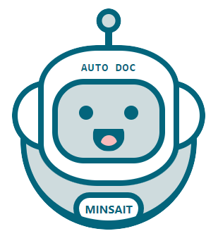

# AutoDoc
---

[](https://opensource.org/licenses/MIT)

AutoDoc es un herramienta que automatiza la generación de documentación de los pases en JIRA del flujo SDLC y automatiza tareas manuales.

[AutoDoc-BCPServer Sources](https://bitbucket.lima.bcp.com.pe/projects/LKDVBCP/repos/bcpserver-autodoc-sources/browse)



# Contenido
---

1. [WorkFlow](#workflow)
1. [¿Cómo usarlo?](#uso)
1. [Validaciones](#validaciones) 

# 1. WorkFlow <a name="workflow"></a>
---

  

<br>

# 2. ¿Cómo usarlo? <a name="uso"></a>
---

Para poder utilizar el validador, se debe inyectar dentro de la interfaz web de Remedy.

1.   Ya con el servidor iniciado, podemos iniciar el app AutoDoc: [http://localhost:5555](http://localhost:5555)
    ```
    <br>
   
1. Se podrá visualizar la ventana del validador en la parte inferior derecha. Para iniciar la validación, dar click al botón **'Validar'**

<br>

# 3. Validaciones <a name="validaciones"></a>
---

- Valida el ticket correcto para la coneccion de Bitbucket.


<br>


