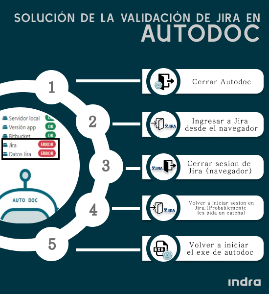

# Problemas con la validación de los accesos a Jira
---

AutoDoc consulta los Accesos con Jira, al realizar este proceso pueden suceder problemas con el caché, por lo que se recomienda seguir los siguientes pasos:

## 1. Borrar la caché y las cookies del navegador crhome

- En tu computadora, abre Chrome.
- En la esquina superior derecha, haz clic en Más //icono.
- Haz clic en Más herramientas y luego Borrar datos de navegación.
- En la parte superior, elige un intervalo de tiempo. Para borrar todo, selecciona Todos los períodos.
- Marca las casillas junto a "Cookies y otros datos de sitios" y "Imágenes y archivos almacenados en caché".
- Haz clic en Borrar datos.

## 2. Pasos adisionales 
- Cerrar AutoDoc.
- Ingresar a Jira desde el navegador.
- Cerrar sesion de Jira (navegador).
- Volver a iniciar sesion en Jira. (Probablemente solicite validar catcha).
- Volver a iniciar el ejecutable de AutoDoc. (BCPServer.exe).

---

  
