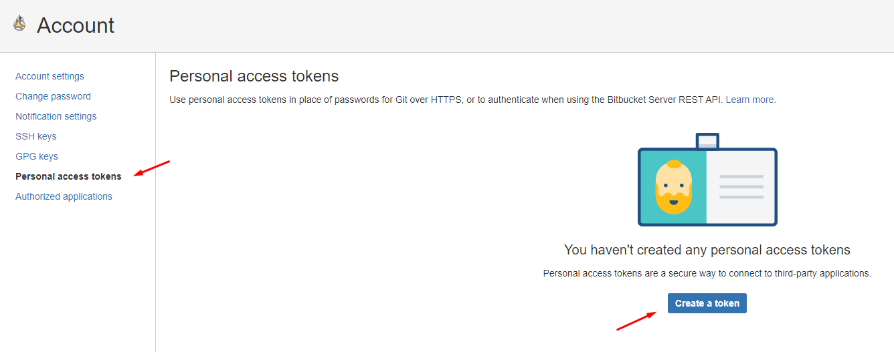
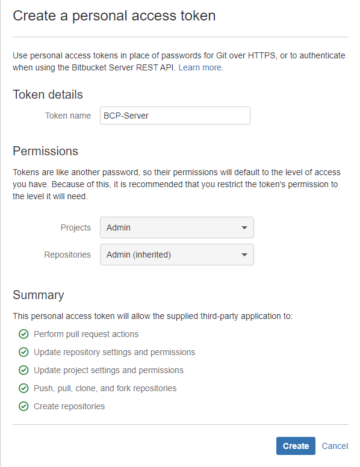
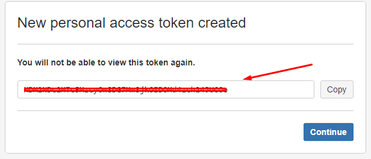

# Generar tokens personales en Bitbucket
---

El proceso de generación de tokens personales es el mismo tanto para Bitbucket SDLC y Legacy.

## 1. Ingresar a vuestro perfil y a la sección de 'Personal access token'

- [Personal token - Bitbucket SDLC](https://bitbucket.lima.bcp.com.pe/plugins/servlet/access-tokens/manage)
- [Personal token - Bitbucket Legacy](https://sources.lima.bcp.com.pe/plugins/servlet/access-tokens/manage)

En la ventana, debes seleccionar **'Create a token'**.

## 2. Generar token personal

Colocar un nombre al token y asignar los permisos de `ADMIN` a la sección `Projects` y `Respositories`, y finalmente dar al botón **'Create'**

## 3. Copiar Token personal

Podrá visualizar el token que bitbucket generó, esa cadena de caracteres debes copiarlo y guardarlo, ya que solo se visualizará una única vez.

Por último, click en el botón **'Continue'**.