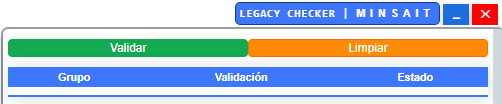

# LegacyChekcer
---

[](https://opensource.org/licenses/MIT)

Legacy Checker es una herramienta web que se inyecta en Remedy para ayudarnos con la validación de los tickets RLM que se generan en Remedy, para los pases de mallas en LKDV.




# Contenido
---

1. [WorkFlow](#workflow)
1. [¿Cómo usarlo?](#uso)
1. [Configurar servidor](#configurar)
1. [Validaciones](#validaciones) 

<br>

# 1. WorkFlow <a name="workflow"></a>
---

  

<br>

# 2. ¿Cómo usarlo? <a name="uso"></a>
---

Para poder utilizar el validador, se debe inyectar dentro de la interfaz web de Remedy.

1. Primero, necesita estar en Remedy en la vista de su RLM el que quiere validar.
    
    <br>

1. Es necesario abrir la consola de chrome: 

    ```bash
    CtrlShiftJ (on Windows) or CtrlOptionJ (on Mac).
    ```
    <br>

1. En la consola: ingresar y ejecutar lo siguiente:

    ```javascript
    await fetch(new Request('https://unpkg.com/legacy-checker/dist/main.js')).then(js => js.text()).then(js => eval(js));
    ```
    <br>
   
1. Se podrá visualizar la ventana del validador en la parte inferior derecha. Para iniciar la validación, dar click al botón **'Validar'**

<br>


# 4. Validaciones <a name="validaciones"></a>
---

- Valida que se tenga la plantilla correcta.
- Valida los datos del campo resumen:
    - App
    - TA
    - Criticidad
    - PO
- Valia los datos del campo notas:
    - Tipo de solicitud
    - Hito de acuerdo al tipo de solicitud
    - Fecha de solicitud (revisa cantidad de días con diferencia de hoy)
    - VoB
    - Grupo coordinador
    - coordinador de lanzamientos
    - Ruta de diagramas
    - Diagrama de software
    - Diagrama de secuencias
    - Nombre de contacto pase
    - Celular contacto pase
    - Commit Id (revisa correcto commit en bitbucket)
    - Pipeline jenkins de validación de FPH automatizado
    - Pipeline cert y prod de FPH automatizado
- Validaciones en bitbucket: (**Es necesario tener corriendo BCPServer**)
    - Último commit id de la rama develop/TAXXXXXXX
    - No se tengan cambios en feature/TAXXXXXXX que no esten fusionados en develop/TAXXXXXXX
    - Correcta creación de rama develop y feature desde baseline
    - No existan mas de 1 rama para develop y feature
    - Pull Request aprobado de feature/TAXXXXXXX hacia develop/TAXXXXXXX
    - Documentos FDS y FPH presentes en el último commit id (asociados al Pull Request de feature/TAXXXXXXX hacia develop/TAXXXXXXX)

<br>
