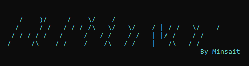

# BCP SERVER
---

[](https://opensource.org/licenses/MIT)

BCP Server es una aplicación que genera un servidor para la conexión con Bitbucket y Jira. El uso de BCP Server es necesario para poder utilizar las herramientas de AutoDoc y Legacy Checker.



<br>

# Contenido
---

1. [WorkFlow](#workflow)
1. [Estructura servidor](#estructura)
1. [Configurar servidor](#configurar)
    - [Configurar appsettings.json](#configurar-appsettings)
      - [Configurar Jira](#configurar-jira)
      - [Configurar Bitbucket](#configurar-bitbucket)
      - [Configurar Datalake](#configurar-datalake)
1. [Ejecutar Herramientas](#ejecutar) 

<br>

# 2. Estructura <a name="estructura"></a>
---

  Para utilizar la herramienta necesita descargar la última versión: 
  [Descargar BCP Server Release](https://bitbucket.lima.bcp.com.pe/rest/api/latest/projects/LKDVBCP/repos/bcpserver-autodoc-release/archive?at=refs%2Ftags%2Flatest&format=zip)

  Podrá encontrar la siguiente estructura:

  ```bash
  BCPServer/
  ├── wwwroot/
  ├── appsettings.json
  ├── BCPServer.exe
  └── web.config
  ```

  Los siguientes ficheros/carpetas son de importancia:

  - `wwwroot/` Esta carpeta contiene ficheros del app web de autodoc.
  - `appsettings.json` Este es el fichero de configuración de credenciales y hosts.
  - `BCPServer.exe` Ese es el aplicativo que inicia el servidor web.

<br>

# 3. Configuración <a name="configurar"></a>
---

  ### CONFIGURAR APPSETTINGS.JSON <a name="configurar-appsettings"></a>

  En el fichero encontraremos distintas configuraciones, entre ellas los hosts de Jira, Bitbucket y Bitbucket Legacy.

  ```json
  {
    "BCP": {
      "Jira": {
        "Host": "https://jira.lima.bcp.com.pe",
        "UserName": "[UserJira]",
        "Password": "[PasswordJira]",
        "TicketSource": "..." //--> El valor que este aquí, no debe modificarse
      },
      "Bitbucket": {
        "HostSDLC": "https://bitbucket.lima.bcp.com.pe",
        "HostLegacy": "https://sources.lima.bcp.com.pe",
        "TokenLegacy": "[Token-Bitbucket-Legacy]",
        "TokenSDLC": "[Token-Bitbucket-SDLC]",
        "ConstructionBranch": "construccion",
        "DevelopBranch": "develop",
        "MasterBranch": "master",
        "VersionFile": "version"
      },
      "DataLake": {
        "UserName": "[UserLKDV]",
        "Password": "[PasswordLKDV]",
        "DataLakeServerHost": "pcdedged02.datalake.local",
        "HiveServerHost": "desarrollo.datalake.local",
        "HivePort": "10000"
      },
    }
    ...
  ```

  > **OJO:** Una vez configurado este fichero, con vuestras credenciales, no deben compartir o distribuir este, ya que si otra persona utiliza vuestras credenciales ambos recibirán una amonestación de seguridad.
  <br>

  ### Configurar Jira <a name="configurar-jira"></a>

  Debes colocar tus credenciales en la sección de jira, usuario y credencial de red.

  ```json
  {
      "Jira": {
          "UserName": //"[UserJira]",
          "Password": //"[PasswordJira]",
          ...
      },
  }
  ```
  <br>

  ### Configurar Bitbucket <a name="configurar-bitbucket"></a>

  Primero debes [generar tus tokens personales en bitbucket](./generar-token-bitbucket.md).

  Una vez tengas los tokens generados, debes colocar los tokens en el lugar correspondiente:

  ```json
  {
      "Bitbucket": {
        "TokenLegacy": "[TokenBitbucketLegacy]",//--> Ingresar el codigo generado por el Token para Legacy Checker
        "TokenSDLC": "[TokenBitbucketSDLC]",//--> Ingresar el codigo generado por el Token para AutoDoc
        ...
      }
  }
  ```
<br>

### Configurar Datalake <a name="configurar-datalake"></a>

  Debes colocar tus credenciales en la sección de datalake, usuario BT y la contraseña del datalake.

  ```json
  {
      "DataLake": {
        "UserName": //"[UserLKDV]",
        "Password": //"[PasswordLKDV]",
        "DataLakeServerHost": "pcdedged02.datalake.local",
        "HiveServerHost": "desarrollo.datalake.local",
        "HivePort": "10000"
      },
  }
  ```
> **Nota:** Esta credencial se utiliza para la generación automática de scripts para backup.
<br>

# 4. Ejecutar <a name="ejecutar"></a>
---

  Una vez configurado los parametros necesarios, debes ejecutar el fichero `BCPServer.exe`, teniendo un resultado como este:


  Ya con el servidor iniciado, podemos iniciar el app AutoDoc: [http://localhost:5555](http://localhost:5555)


## Herramientas

1. [AutoDoc](./docs/autodoc.md) 
2. [Legacy Checker](./docs/legacy-checker.md) 

## Autores

<!-- - [@bryannehuaman](mailto:bryannehuaman@bcp.com.pe) -->
- MINSAIT - INDRA

